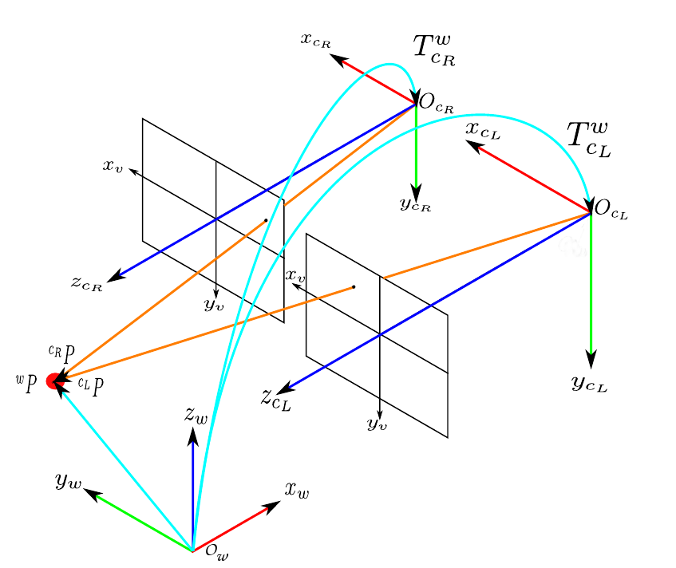

# Crossbow Project Documentation

The purpose of this README is to document as much as possible this project. The objective is to provide all the necessary informations for someone to be able to understand its mechanics and work on its development.

As of today (March 2025), we remind that the aim of this tool is to extract the kinematics of a moving target, by using a setup of high speed cameras.

## Simplified class diagram

The overall (simplified) architecture of this project is visible hereafter:

## The configuration file

First things first, in order to run, the tool needs to be provided a configuration file. This configuration file is a simple JSON file that gives information about the conditions of the experience. This is the only thing that needs to be filled out manually by the user.  
An example of configuration file is provided : [./utils/configuration_example.json](../utils/configuration_example.json).  

### The content of the configuration file

This configuration file requires the characteristics of both cameras used:  
- The intrinsic parameters (they are dependent on the camera used)
- The extrinsic parameters (they are independant on the camera used)

**You are free to chose your unit system, but no matter what you do, you MUST remain consistent !!!**
> I highly recommend using the metric system since the focals of the cameras are almost always given in the metric system.

The extrinsic parameters also require angles. The choice not to use the classical yaw, pitch, roll angles was made intentionally, to not confuse the reader, since the frame used is not the same as the one on an aircraft. Instead, we use the alpha, beta and gamma angles. These angles design the rotations around the X,Y and Z axis, with respect to the world coordinate system.  
The camera reference system is an orthogonal direct frame, as shown below : 

  

Regarding the world reference system, it is up to you to decide it. The choice of this system should be mentionned in your experience plan.
> Usually, this system is chosen to be one of the camera's reference system. Therefore, only 6 measurements needs to be done (3 translations, 3 rotations corresponding to 1 camera) instead of 12 (3 rotations, 3 translations per camera).

To clarify what we are trying to extract, we must be able to retrieve both the camera's reference system with respect to the world coordinates system, as shown in the image below.

  

In this case, the choice for the world coordinate system is poorly made, but this experimental plan would be absolutely valid ! As long as you have made the correct measurements, any world coordinates system is fine

### The Config

The reader of the configuration file is a simple JSON reader. It is located at [./src/configuration_reader.py](../src/configuration_reader.py).
This is a simple class that ensures the validity of the config, and stores it into two class objects called *CameraConfig*. The attributes of a *CameraConfig* instance are visible in the [simplified class diagram](#simplified-class-diagram).  
In the event someone would like to modify the architecture of the configuration file, the verification schema should also be modified. This schema is located in the [./src/constants.py](../src/constants.py) file.

The Config class created with the configuration file is then used to create/update other classes of the tool:

- The FilesManager
- The CameraSetup
- The ExperienceManager

---

## The FilesManager

The FilesManager class is designed to... manage the files. More especially, it is the class that will provide the appropriate images path on which we will perform image processing.  
This class is crucial in order to get precise and valid results. The main objective of this class is to yield pairs of images taken by both cameras at the same time. Concretely, at each step of time, the FilesManager is called to get the image taken from the left camera and from the right camera at this specific time.

### What path does it use ?

The FilesManager will only consider path to images in the following formats: *.jpg .png, .jpeg, .tif*.  
You can choose to add other formats in the [./src/constants.py](../src/constants.py) file.

### How does it create the pair of images 

When I asked about the high speed cameras used at the school, it appears there is already a mechanism to synchronize the capture of many cameras. This is increadibly useful for us, as we do not have to deal with complex matching methods (based on timestamps for instance).  
The function we use is `create_list_timed_matching_image_path_pair`. It itself calls `find_closest_image_path_to_form_pair`.  
Because we are lucky to have this setup (synchronization), the last function is trivial. Otherwise, this is the function that would require a bit of logic to form the appropriate pairs of images.

---

## The CameraSetup

This class is used to store the information on the cameras. It is used to store the intrinsic and extrinsic matrix of both cameras. The product of those matrix is called the projection matrix. The projection matrix is the one that will be used afterwards to compute the 3D points from a pair of 2D points.  
It simply contains two instances of `HighSpeedCameras`

---

## The DataTypes

Before going further into this documentation, it appears wise to explain the different data types used. I will be honest here, even I get confused sometimes regarding the architecture of the different data types. The data types are stored in [./src/data_types/data_types.py](../src/data_types/data_types.py).  
That said, the architecture is shown below :

Here is a fast tour on how this works:

### The basic types 

The most basic types created are: 

- Point2D
- Point3D
- default types (str for path, np.ndarray for images...)

### The Pair type

This type is simply a pair of variables of the same type. It can be anything, as long as it is the same type.  
It was created because we encounter pairs almost all the time in this repository: pair of cameras, pairs of images, pairs of points...  
The attributes of this class are simply called `left` and `right`. For this reason, we will always talk about left camera, left point, left image... This has nothing to do whatsoever with the position of the cameras on the experiment.

### The TimedData type

In addition to dealing with lots of pairs, we also deal with lots of timed data. Indeed, we have timed images, timed coordinates, timed path...  
For this reason, it was decided to add create a `TimedData` class. This class simply possesses a `timestamp` and a `data` attribute. There exists no restriction on the type of the data.

### Combination of data types

Of course, now that we set our data types, we can combine them to make more useful ones. For instance we have:

- Point2DPair
- ImagePair
- TimedPoint3D
- TimedPoint2DPair
- ...

At this point, I am pretty sure the code is ugly and could be optimized and much prettier. However, this works like that and we are not yet at the point where we have types that we lose track of some.

---

## The enumerations

Few but important, here are the enumerations used in this project. As of right now, they are stored in [./src/constants.py](../src/constants.py) (which come to think of it, is not really consistent with the name of the file, but whatever).
They are visible in this diagram:

Their purpose will reveal to you if you keep reading this...

---

## The ProjectileFinder

This [class](../src/image_processing/projectile_finder.py) is absolutely **CRUCIAL** in the code. This class is responsible for providing the methods of detection in the images. The aim of this class is to be able to be easily expanded. That is, you should be able to add your own detection methods easily wihtout having to spend too much time on how is the code working elsewhere.  
The class itself is very small: 1 attribute and 1 method. 

Let's start with the attribute:

`_finder_function_mapping`: this is a map that whose keys are an enumeration `AvailableProjectileFinderMethods` and variables are callable (=functions).  
This attribute simply stores the existing functions to find targets, and associate them with a key stored in an enumeration.

Now the method: 

`get_projectile_finder_function`: this function take as parameters a `AvailableProjectileFinderMethods`, and simply returns the function that corresponds to the key you are asking.

That's it, as simple as that.

### How to add my own detection method ?

As said above, the objective of this class is to be easily expandable. You may add your own method using the following protocol:

1. Write the method. The only restriction is that your method **MUST** return a `Point2D` object.
2. Add an enumeration key to your method. The key name should represent your method, and be added to the `AvailableProjectileFinderMethods` enumeration, in the [./src/constants.py](../src/constants.py) file.
3. Add the mapping to the `_finder_function_mapping` attribute of the [ProjectileFinder](../src/image_processing/projectile_finder.py) class.

Well done, your function may not be used! We will explain how to call it in the nexts sections.

---

## The ImageProcessor

This [class](../src/image_processing/image_processor.py) aims at performing image processing on single images. Honestly it is not a very expensive class and is fairly easy to understand. It was created as it is the only class that will actually use the images. When performing image processing, it should only be done through an instance of this class (images are expensive in memory, and we should not deal with too many images at once). 

Of course, this class is extended into a ImagePairProcessor class, whose only purpose is to manipulate more easily the code, and not lose track of everything when developing new functionalities.

Long story short, this class is the numerical representation of an image that was taken. It keeps track of its camera, and it can perform processing actions on itself. Cool.

---

## The ExperienceManager

You probably already guessed it by the name of this [class](../src/managers/experience_manager.py), this is the backbone of this tool. Indeed, the ExperienceManager class manages all of the above classes and is responsible for producing the final kinematics of the projectile.  
As a result, this class possesses many attributes that are classes defined below:

### The attributes

- `_configuration`: a Config instance
- `_camera_setup`: a CameraSetup instance
- `_image_pair_processor`: an ImagePairProcessor instance
- `_files_manager`: a FilesManager instance

By this point, you should know what each of these instance is responsible for. In addition to that, the ExperienceManager also possesses the following attributes:

- `_list_timed_pair_projectile_coordinates_2d`: This is list. Each element of this list is a TimedPoint2DPair. It corresponds to the coordinates of the projectile that was found in a pair of images.
- `_list_timed_projectile_coordinates_3d`: This is list. Each element of this list is a TimedPoint3D. It corresponds to the reconstruction of the 3D point of the projectile, from the pair of 2D points.
- `_list_timed_projectile_speed_3d`: This is list. Each element of this list is a TimedPoint3D. It corresponds to the 3D speed of the projectile. It uses the position to compute the classical discrete time derivative. It has N-1 elements than the positions
- `_list_timed_projectile_acceleration_3d`: This is list. Each element of this list is a TimedPoint3D. It corresponds to the 3D acceleration of the projectile. It uses the speed to compute the classical discrete time derivative. It has N-2 elements than the positions

Now that we have an overview of the different attributes of the ExperienceManager, we will take a look at its methods.

### Methods

The **Experience Manager** provides several methods. For an inexperienced user, only public methods should be used. These methods are described below. The private methods are considered to be named well-enough to be understood for someone that would like to apply changes to the code. (sorry)

#### Public Methods

These methods are accessible when instantiating an `ExperienceManager` and are the ones you are most likely to use.

---

#### `set_projectile_finder_method(method: AvailableProjectileFinderMethods)`

Sets the method used to detect a projectile in the image.  

- **Parameter:**  
  - `method` (`AvailableProjectileFinderMethods`): The chosen projectile detection method.

---

#### `set_color_domain_to_find_projectile(domain: ColorDomain)`

Sets the color domain in which the projectile will be detected. Some image processing methods work in grayscale, while others work in color.  
Ensure this function is called in accordance with the detection function you have chosen.  
The required color domain should be referenced in the [ProjectileFinder section](#the-projectilefinder).

- **Parameter:**  
  - `domain` (`ColorDomain`): The chosen color domain.

---

#### `extract_projectile_2d_coordinates_in_image_pairs(*args, **kwargs)`

Finds the projectiles in all images selected by `_files_manager` and constructs the `_list_timed_pair_projectile_coordinates_2d` attribute.  

- Accepts any number of positional (`*args`) and keyword (`**kwargs`) arguments, allowing custom projectile finder methods with multiple inputs.  

> **Warning:** Before using this function, you must first call:
> - `set_projectile_finder_method`
> - `set_color_domain_to_find_projectile`

---

#### `compute_trajectory()`

Computes the projectile's **3D trajectory** and constructs the `_list_timed_projectile_coordinates_3d` attribute.  

> **Warning:** Before using this function, you must first call `extract_projectile_2d_coordinates_in_image_pairs`.

---

#### `compute_speed()`

Computes the projectile's **speed** and constructs the `__list_timed_projectile_speed_3d` attribute.  

> **Warning:** Before using this function, you must first call `compute_trajectory`.

---

#### `compute_acceleration()`

Computes the projectile's **acceleration** and constructs the `__list_timed_projectile_acceleration_3d` attribute.  

> **Warning:** Before using this function, you must first call `compute_speed`.

---

#### `compute_kinematics(*args, **kwargs)`

Computes **all kinematic properties** (trajectory, speed, and acceleration) in one step.  
This is likely the function you will use most frequently.

- Accepts any number of positional (`*args`) and keyword (`**kwargs`) arguments, allowing custom projectile finder methods with multiple inputs.  

> **Warning:** Before using this function, you must first call:
> - `set_projectile_finder_method`
> - `set_color_domain_to_find_projectile`

---

#### `plot_trajectory()`

Plots the **projectile’s trajectory**.  

> **Warning:** Before using this function, you must first call `compute_trajectory`.

---

#### `plot_speed_vector()`

Plots the **speed vector** of the projectile.  

> **Warning:** Before using this function, you must first call `compute_speed`.

---

#### `plot_speed_magnitude()`

Plots the **magnitude of the speed** over time.  

> **Warning:** Before using this function, you must first call `compute_speed`.

---

#### `plot_acceleration_magnitude()`

Plots the **magnitude of the acceleration** over time.  

> **Warning:** Before using this function, you must first call `compute_acceleration`.

---

#### `save_results_as_csv(filename: str = "results.csv")`

Saves all kinematic results (**time, position, speed, acceleration**) in a CSV file for further analysis (e.g., with Excel).  

- **Optional Parameter:**  
  - `filename` (`str`, default: `"results.csv"`): Custom name for the CSV file.  

The file is saved in the `result` folder at the root of the repository.

---

## To help you: the [run_experience.py](../src/run_experience.py) file !

Well done for reading through this documentation !  
As a reward, we provide with this code a file that lets you play around. This is the file that will be run when following the run instructions of the [main README.md](../README.md).  
Feel free to test the (few but working!) possibilities provided by the experience manager :)

---

## Note for the end:

First of all, thank you for reading up until now (if you just scrolled to this, I do not blame you). I hope this project will turn useful in the future.  
In case you have questions, you can contact me on my school email: erwan.toux@student.isae-supaero.fr. I will mostlikely not provide extensive assistance, but I would be glad to help and see this project go on !
Please keep in mind that this work was done for a student project, and I tried my best to make it easy to onboard/improve/use.